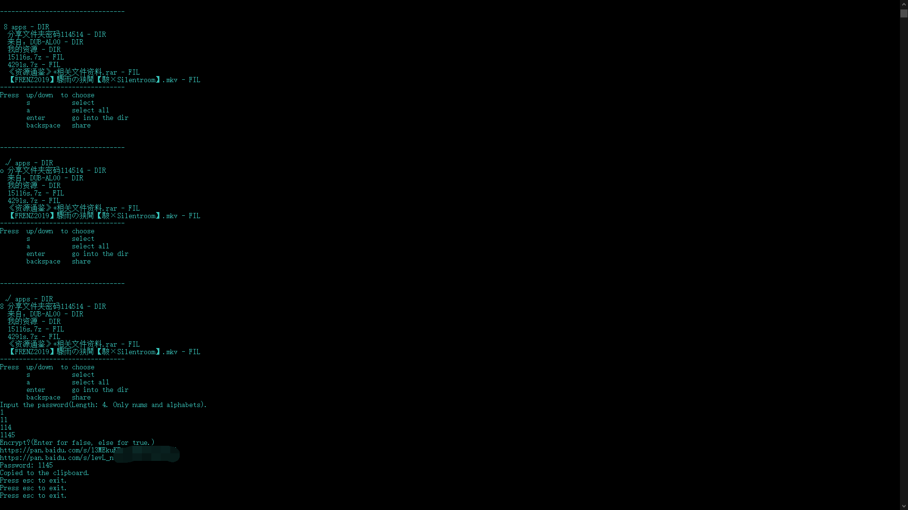

# 百度网盘批量分享工具

运行main.py以启动。

## 会在当前目录生成的文件的列表

* config.ini

## 第一次启动

输入[API](#api的cookie获取方法)的Cookie。\
如图:

### 进入百度网盘根目录，操作方法:

* 输入上下选择文件。
* 输入s键选中文件。
* 输入回车键进入目录。
* 输入退格键在根目录为生成分享链接，在其他目录为返回上级目录。\
  如图:
  

### 文件左侧标记解释

* 文件左侧为o，则被选择。
* 左侧为√，则被选中。
* 左侧为8，则同时被选择与选中。\
  如图:
  

## 确认分享，根据提示输入两个参数：

    password
    encrypt

### password

即分享链接提取码，四位，由数字和密码任意几种组合而成。

### encrypt

输入空为否，其余为是。\
倘是，则链接需手动加上pan.baidu.com/s/。

### 效果如对比图:

## API的cookie获取方法

_此处用chrome浏览器示范。_

### 在浏览器中登录百度网盘

### 访问[API](https://pan.baidu.com/api/list?dir=%2F)，并进入控制台（快捷键：F12）——网络一栏

### 复制请求标头中的Cookie项的值

### _我自己踩的坑_

_console里document.Cookie与请求标头中Cookie不同，所以半天验证不到身份。即便如此请求标头中的Cookie也有无效的可能，目前能给出的建议就是获取前将百度盘的Cookie清除。_